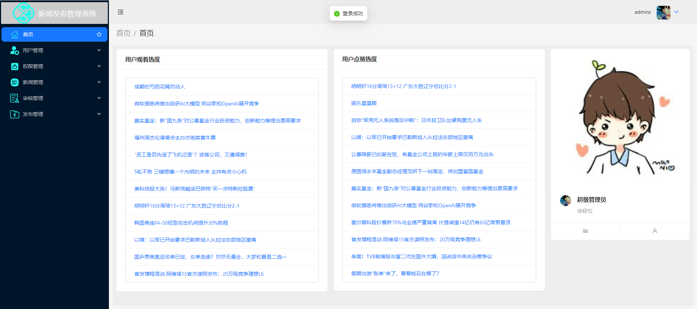
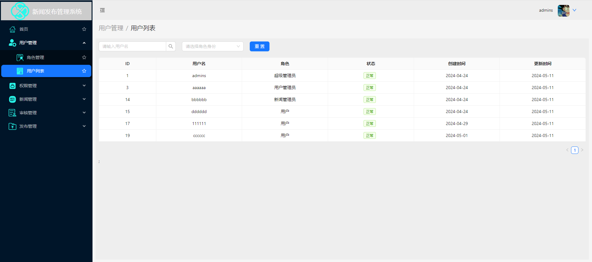
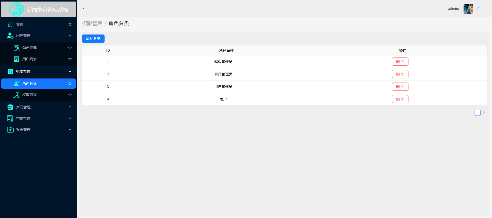
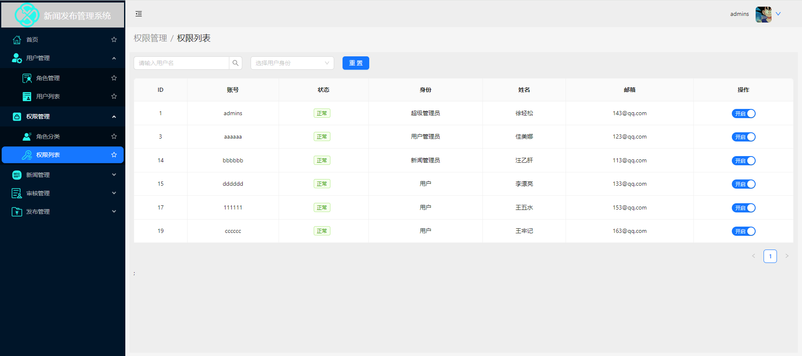
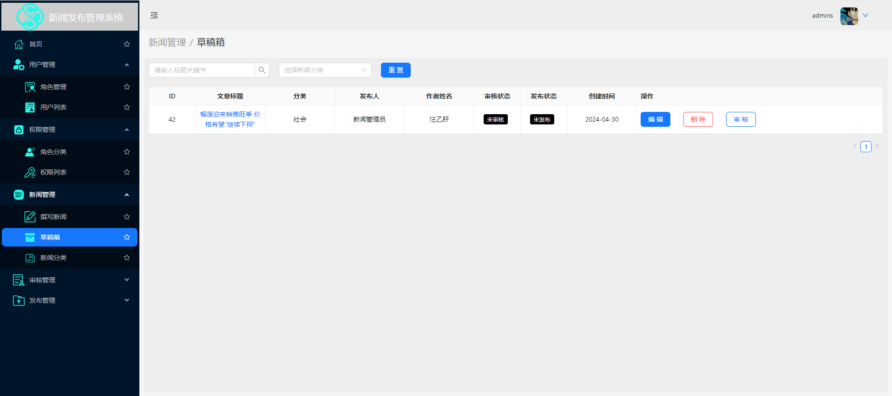
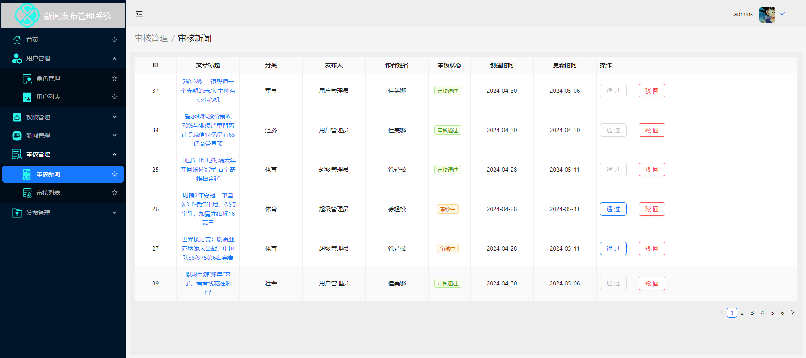
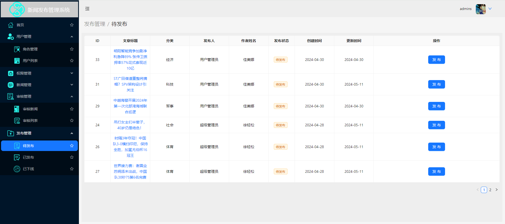
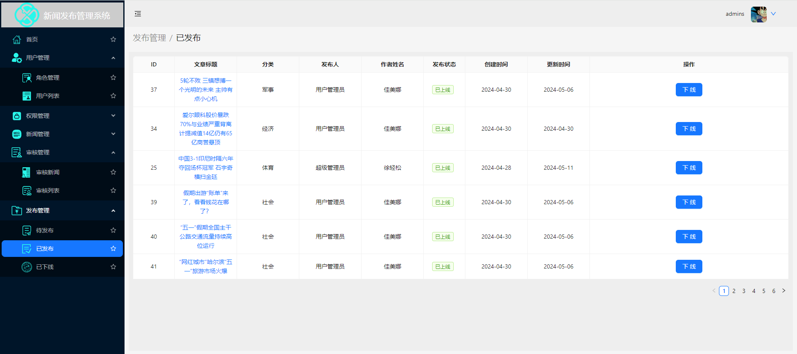
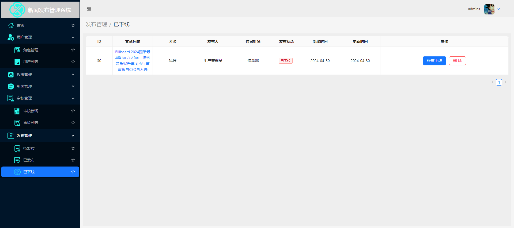

####  这是一个 react18 +express 全栈项目

技术栈包括：

react18+react-router+antd5+pro components +react-redux+express+mysql

### 依赖安装
npm install

### 启动
npm start 

##  后台仓库地址
[后台接口地址](https://github.com/xrg1436977188/back-news)

部分前端页面展示如下：

一、首页

二、用户管理

用户列表

三、权限管理

权限列表

四、新闻管理

五、审核管理

六、发布管理

### 依赖安装
npm install

### 启动
npm start 
